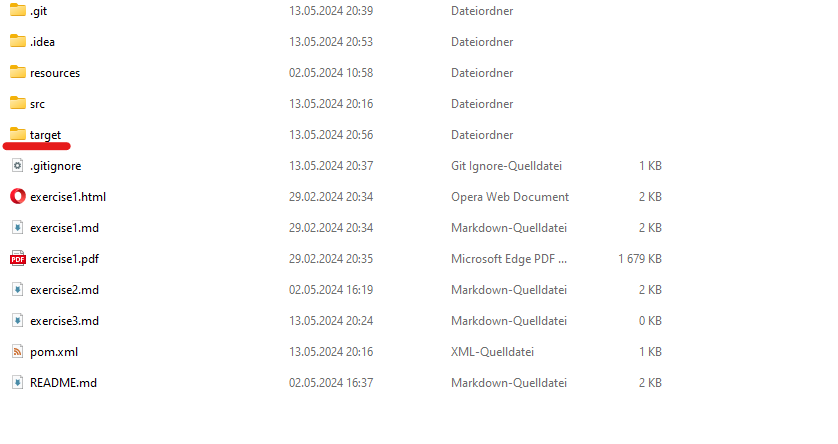
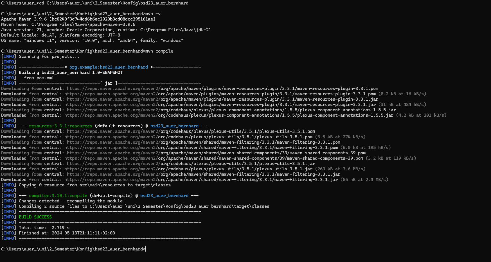
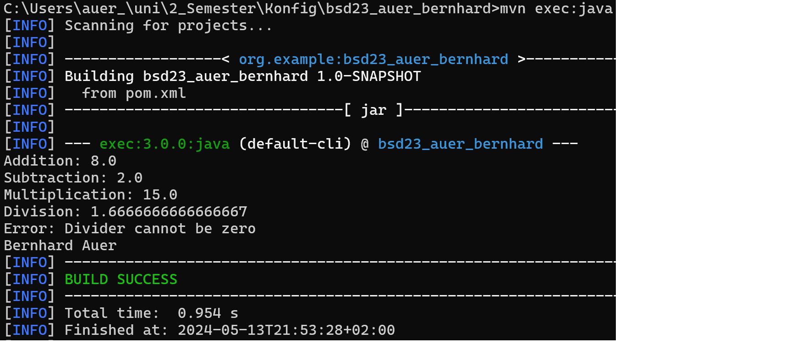

# Übung 3: Maven Projektstruktur und Git

## Einleitung

In dieser Übung geht es darum, ein Java-Projekt mit Hilfe von Maven zu erstellen und es mithilfe von Git zu versionieren. Ziel ist es, die praktische Anwendung von Build-Automatisierungswerkzeugen und Versionskontrollsystemen zu erlernen.

## Schritte der Übung

### Neues Maven-Projekt erstellen

- **IDE verwenden:** Ich habe IntelliJ IDEA verwendet, um ein neues Maven-Projekt zu erstellen.
- **Projektname und Speicherort:** Der Projektname wurde als `msd23_auer_bernhard` festgelegt und im Wurzelverzeichnis meines Git-Repositories gespeichert.

### Maven Projektstruktur

- **POM.XML:** Die `pom.xml` wurde erstellt und grundlegende Abhängigkeiten sowie Plugins konfiguriert.
- **Verzeichnisstruktur:** Die Standard-Maven-Verzeichnisstruktur wurde eingerichtet, einschließlich `src/main/java` und `src/test/java`.

### Implementierung der Calculator-Klasse

- **Klassen und Methoden:** Ich habe die `Calculator`-Klasse mit Methoden für Addition, Subtraktion, Multiplikation und Division erstellt.
- **Test der Funktionalität:** Die Methoden wurden durch einfache Java-Ausführungen in der `Main`-Klasse getestet.

### Versionierung mit Git

- **Git Add und Commit:** Alle neuen Dateien wurden zum lokalen Git-Repository hinzugefügt und committet.
- **Push zum Remote-Repository:** Die Änderungen wurden erfolgreich zum Remote-Repository gepusht.

### Screenshots

#### Erstellung des Maven-Projekts

#### Ergebnisse der Funktionstests

#### Erfolgreicher Build und Ausführung

